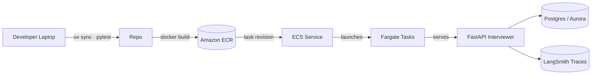
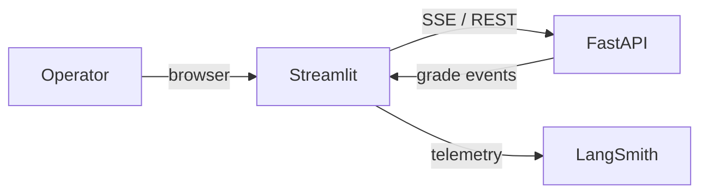
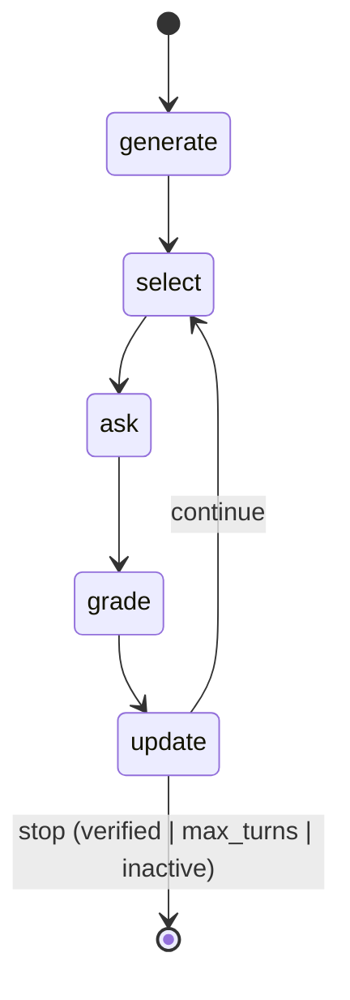

# AI Interviewer

LangGraph-powered interviewing assistant that verifies a candidate’s claimed skills by asking adaptive questions, grading answers with an LLM, and tracking Bayesian confidence scores in real time. The stack bundles a FastAPI service, a Streamlit operator console, and persistence helpers so interviews can pause, resume, and surface audit trails.

## Project Description
- **Goal**: Confirm whether a candidate is genuinely proficient in the skills they declare by iterating on questions until the model is confident.
- **Agent loop**: `generate → select → ask → grade → update → decide` orchestrated by LangGraph (`src/app/agents/interviewer/graph.py`). Each node focuses on one concern and writes back to a shared `InterviewState`.
- **Service plane**: FastAPI endpoints (`/interviewer/invoke`, `/interviewer/stream`, `/interviewer/resume`) in `src/app/service/service.py` gate access, manage session storage, and stream SSE events to the UI.
- **Operator UI**: `src/streamlit_app.py` consumes the SSE feed, captures human answers, and visualises verification status.
- **Persistence & config**: Typed models live in `src/app/schema/models.py`; `src/app/storage/store.py` writes interview state to Postgres with an in-memory fallback; `src/app/core/config.py` centralises environment settings and LLM defaults.

## File Structure
```text
prolific_interview/
├── app/main.py                    # CLI placeholder
├── docker/                        # Container builds for agent + dependencies
├── docs/                          # Architecture notes and diagrams
├── infra/                         # AWS CDK stacks for ECR, IAM, ECS helpers
├── notebooks/                     # Bandit experiments and simulations
├── scripts/                       # Operational scripts (deploy, lint)
├── src/
│   ├── streamlit_app.py           # Operator-facing dashboard (Streamlit)
│   └── app/
│       ├── agents/interviewer/    # LangGraph nodes, prompts, utilities
│       ├── service/               # FastAPI application & session helpers
│       ├── storage/               # SQLAlchemy engine + state persistence
│       ├── core/                  # Settings + LLM factory
│       ├── schema/models.py       # Pydantic models / InterviewState typing
│       └── client/client.py       # Thin HTTP + SSE client
├── test/                          # Pytest suite with service and policy tests
├── Makefile                       # Developer shortcuts (lint, test, run)
└── pyproject.toml                 # Project metadata and dependencies
```

## Core Functions
| Function | Location | Purpose |
| --- | --- | --- |
| `build_state` | `src/app/agents/interviewer/graph.py` | Initialise the interview ledger with priors, confidence thresholds, and cached skill summaries before the LangGraph run starts. |
| `generate_questions_node` | `src/app/agents/interviewer/nodes/generate.py` | Seed one baseline question per skill using the LLM so the agent has deterministic fallbacks if future calls fail. |
| `select_question_node` | `src/app/agents/interviewer/nodes/select.py` | Choose which skill to probe next via UCB, adjust difficulty, and prepare the follow-up question. |
| `grade_node` | `src/app/agents/interviewer/nodes/grade.py` | Score the most recent answer with the grading prompt, capturing both the numeric score and reasoning. |
| `update_node` | `src/app/agents/interviewer/nodes/update.py` | Run Welford updates, recompute LCB, and tag skills as verified or inactive based on thresholds. |
| `decide_node` | `src/app/agents/interviewer/nodes/decide.py` | Decide whether to continue or stop the interview by checking max turns, verification coverage, and remaining active skills. |
| `load_state` / `save_state` | `src/app/storage/store.py` | Persist and recover session state from Postgres (with an in-memory fallback) so interviews can resume mid-flow. |
| `ensure_session_id` | `src/app/service/sessions.py` | Guarantee every client exchange has a stable session identifier to tie HTTP calls back to the same state record. |

## Setup
1. **Dependencies** – Install [uv](https://github.com/astral-sh/uv) and create the Python 3.11 environment with `uv sync`.
2. **Environment variables** – Provide at least the OpenAI key:
   ```bash
   export OPENAI_API_KEY=sk-your-key
   ```
   Optional toggles live in `src/app/core/config.py` and can be overridden via env vars (e.g. `stats_prior_mean`, `stats_se_floor`).

### Monitoring with LangSmith
LangSmith captures end-to-end traces for LangGraph executions, LLM calls, and Streamlit-triggered flows. Enable it by setting:

```bash
export LANGCHAIN_TRACING_V2=true
export LANGCHAIN_PROJECT="prolific-ai-interviewer"
export LANGSMITH_API_KEY=lsm_your_key
```

With tracing on, every interview run is visible in LangSmith’s UI—use it to diff prompts, inspect node inputs/outputs, or replay entire graphs when debugging.

## Local Development
- Run API + UI together:
  ```bash
  make up
  ```

## Architecture at a Glance

### Deployment → FastAPI → Fargate


### Streamlit Operator Path


### High Level System Architecture
```mermaid
flowchart TD
    subgraph 1_Ingestion
        Uploads[CV / LinkedIn Uploads] --> API[Credential API]
        API --> S3[S3: Raw Files]
        API --> SQS[SQS Queue]
        SQS --> ParserJob[Parser Job<br/>(LLM-based Extraction)]
        ParserJob --> ProfileDB[(Profile Store: DynamoDB)]
    end

    subgraph 2_Interviewer
        ProfileDB --> FastAPI[[AI Interviewer API<br/>LangGraph Workflow]]
        FastAPI --> Postgres[(Session DB)]
        FastAPI --> LangSmith[(Tracing / Logs)]
        Console[Operator Console (Streamlit)] <---> FastAPI
    end

    subgraph 3_Verification
        FastAPI --> Verifier[Verifier<br/>(External Sources / Consistency)]
        Verifier --> ProfileDB
    end

```

1. Credential Ingestion
- Candidates upload a CV or LinkedIn profile.
- Files go to S3 and trigger a Parser Job (via SQS).
- Parser extracts structured skill data and saves it to DynamoDB.

2. AI Interviewer Core

- FastAPI + LangGraph runs adaptive interview sessions.
- Each turn updates the candidate’s skill confidence scores.
- Postgres stores live session state; LangSmith logs each step for debugging and evaluation.
- Streamlit Console lets an operator monitor or intervene in interviews.

3. Verification Layer

- Runs after each interview session to confirm answer accuracy and consistency.
- Triggered automatically by FastAPI → sends answers to Verifier service (async or via SQS).
- Two main verification modes:
    - External (RAG): retrieves trusted documents or examples to fact-check answers.
    - Internal: compares multiple answers for the same skill to detect contradictions using NLI model such as roberta-large-mnli, bert-large-mnli, etc. First converts each answer into atomic claims (e.g. "gradient clipping prevents exploding gradients" and "clipping happens after backward pass"). Then compares claim pairs to label relationships (entails / neutral / contradicts). Finally aggregates labels into a per-skill consistency score. This structured approach helps catch subtle contradictions that might be missed in holistic comparison.
- Scoring: assigns a calibrated confidence score (0–1) and a verdict (✅ verified / ⚠ uncertain / ❌ inconsistent).
- Outputs stored in Profile DB (DynamoDB) as structured JSON with evidence references.


**Design notes**
- The ingestion plane normalises credentials asynchronously: uploads hit an API, land on SQS, and the parser job (LLM- or rules-based) writes a canonical expertise profile with provenance into an analytical store.
- The AI Interviewer core pulls those profiles, runs the LangGraph workflow (`generate → select → ask → grade → update → decide`), persists sessions in Postgres, and surfaces the flow through FastAPI/Streamlit with LangSmith tracing for observability.
- A verification layer optionally cross-checks answers against stored evidence or external fact sources/NLP consistency models, feeding confidence scores and flags back to the interviewer and UI.

### LangGraph Orchestration


## Bandit Confidence Policies (UCB & LCB)
- **Upper Confidence Bound (UCB)**: Implemented in `src/app/agents/interviewer/utils/stats.py` via `select_skill_ucb_with_log`. In default “ucb1” mode the agent computes `UCB = mean + C * sqrt(log(t) / n_real)`, where `t` is the total number of graded questions so far and `n_real` is the number for the skill (excluding priors). A “se” mode is also available (`mean + C * se`) when you want exploration tied directly to statistical uncertainty.
- **Dynamic difficulty**: `select_question_node` in `src/app/agents/interviewer/nodes/select.py` nudges question difficulty up after high scores (≥4) and down after weak answers (≤2), ensuring the UCB policy probes depth appropriately.
- **Lower Confidence Bound (LCB)**: `compute_uncertainty` in `src/app/agents/interviewer/utils/stats.py` combines the running mean and variance to produce `LCB = mean - z * standard_error`. The z-score comes from the request payload so the service can tune strictness per interview, and a prior pseudo-count keeps early confidence intervals honest.
- **Verification rule**: `update_node` in `src/app/agents/interviewer/nodes/update.py` declares a skill verified only when two conditions hold: the agent has asked at least `min_questions_per_skill` and the computed LCB clears the `verification_threshold`. Failing scores push the skill into an inactive pool so UCB stops sampling it, prompting `decide_node` to wrap up if no active skills remain.

## To do

- [x] Setup LangSmith for monitoring and debugging
- [x] Polish notes and notebook for better documentation
- [x] Add architecture diagrams
- [x] Add LangGraph orchestration charts
- [x] A section on UCB and LCB for the selector node
