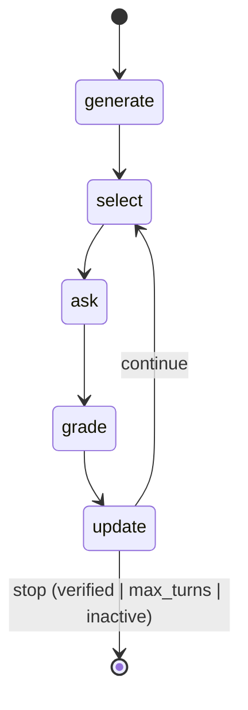
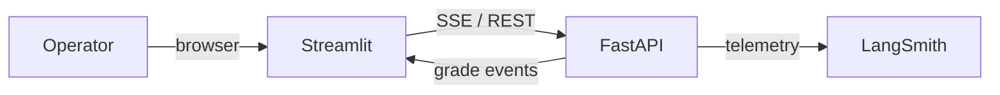
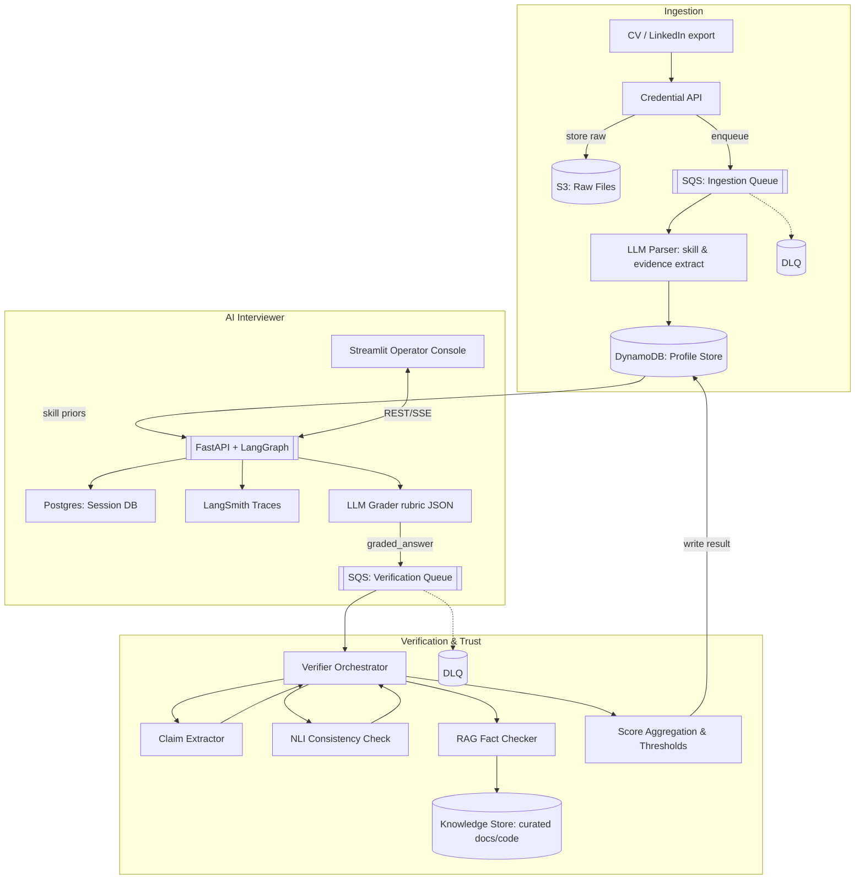
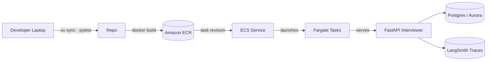

# AI Interviewer

LangGraph-powered interviewing assistant that verifies a candidate’s claimed skills by asking adaptive questions, grading answers with an LLM, and Lower Confidence Bound (LCB) and Upper Confidence Bound (UCB) in real time. The stack bundles a FastAPI service, a Streamlit operator console, and persistence helpers so interviews can pause, resume, and surface audit trails.


## Background

The AI interviewer pipleine is quite complex, but let's me take a step back and think what the company is asking for at its core, ground this in a simpler business context:

- Why it matters: The company’s value depends on a trusted pool of verified participants for AI evaluation. If we can’t trust their claimed skills, every downstream dataset and model evaluation becomes unreliable.

- The problem: Participants self-report expertise (“Python expert,” “data scientist,” etc.), but manual vetting doesn’t scale and is prone to bias. We need a systematic, scalable way to algorithmically verify human expertise—accurately, quickly, and at low cost.

- The core question: How can we quantify how much a person actually knows — without a labelled dataset or prolonged human supervision within a limited time. If we are desigining an AI interviewer, we don't have the time to grill the candidate for 30 minutes, this could lead to a bad user experience and the candidate may not be willing to participate.

At its heart, this is a Bayesian evidence-gathering problem under uncertainty and cost constraints.

We’re dealing with:

- Epistemic uncertainty: How sure are we about this person’s expertise given limited evidence?
- Signal extraction: How do we detect competence in unstructured, natural-language responses rather than multiple-choice tests?
- Cost efficiency: How can we reach high confidence in 5–10 turns instead of 30, minimizing API cost and participant fatigue?
- Robustness: How do we resist overclaiming and bluffing, especially when verbal fluency can mimic expertise?
- Scalability: How do we make this process modular, auditable, and repeatable across thousands of interviews daily?


### My proposition
The key challenge is turning unstructured dialogue into structured, evidence-based confidence estimates — efficiently and adaptively.

My prototype demonstrates a LangGraph-powered conversation flow manager that behaves like a multi-armed bandit under epistemic uncertainty.
Each “arm” represents a skill or subskill. Each question-answer exchange provides a noisy observation of true expertise. The system must decide:

- Which skill should I probe next?
- When do I have enough evidence to stop?

The interviewer continuously updates its belief state using Welford statistics (running mean and variance) and computes a Lower Confidence Bound (LCB) per skill. When the LCB exceeds a verification threshold, the skill is marked verified.

This setup naturally encodes the exploration–exploitation tradeoff:

- Exploration: Try new questions to reduce uncertainty on less-tested skills.
- Exploitation: Focus on the most promising skills to verify quickly.
- Stopping criterion: When all skills are either verified or deemed unlikely, terminate the interview—minimizing wasted turns and cost.

### Why It Matters

- Information efficiency: The system maximizes information gain per question, making each LLM call count.
- Human trust at scale: Converts soft, conversational evidence into quantifiable confidence — a foundation for large-scale participant verification.
- Auditable and adaptive: Every step (question, grade, confidence update) is logged, replayable, and explainable through LangSmith traces.
- Generalizable: The same architecture can verify any domain expertise — from Python to medicine — with only prompt-layer adjustments.


## Project Description
- **Goal**: Confirm whether a candidate is genuinely proficient in the skills they declare by iterating on questions until the model is confident.
- **Agent loop**: `generate → select → ask → grade → update → decide` orchestrated by LangGraph (`src/app/agents/interviewer/graph.py`). Each node focuses on one concern and writes back to a shared `InterviewState`.
- **Service plane**: FastAPI endpoints (`/interviewer/invoke`, `/interviewer/stream`, `/interviewer/resume`) in `src/app/service/service.py` gate access, manage session storage, and stream SSE events to the UI.
- **Operator UI**: `src/streamlit_app.py` consumes the SSE feed, captures human answers, and visualises verification status.
- **Persistence & config**: Typed models live in `src/app/schema/models.py`; `src/app/storage/store.py` writes interview state to Postgres with an in-memory fallback; `src/app/core/config.py` centralises environment settings and LLM defaults.

## File Structure
```text
prolific_interview/
├── docker/                        # Container builds for agent + dependencies
├── scripts/                       # Operational scripts (deploy, lint)
├── src/
│   ├── streamlit_app.py           # Operator-facing dashboard (Streamlit)
│   ├── ai_interviewer_langgraph_mvp.ipynb # Notebook for the MVP
│   └── app/
│       ├── agents/interviewer/    # LangGraph nodes, prompts, utilities
│       ├── service/               # FastAPI application & session helpers
│       ├── storage/               # SQLAlchemy engine + state persistence
│       ├── core/                  # Settings + LLM factory
│       ├── schema/models.py       # Pydantic models / InterviewState typing
│       └── client/client.py       # Thin HTTP + SSE client
├── test/                          # Pytest suite with service and policy tests
├── Makefile                       # Developer shortcuts (lint, test, run)
└── pyproject.toml                 # Project metadata and dependencies
```


## LangGraph Orchestration



## Core Functions
| Function | Location | Purpose |
| --- | --- | --- |
| `build_state` | `src/app/agents/interviewer/graph.py` | Initialise the interview ledger with priors, confidence thresholds, and cached skill summaries before the LangGraph run starts. |
| `generate_questions_node` | `src/app/agents/interviewer/nodes/generate.py` | Seed one baseline question per skill using the LLM so the agent has deterministic fallbacks if future calls fail. |
| `select_question_node` | `src/app/agents/interviewer/nodes/select.py` | Choose which skill to probe next via UCB, adjust difficulty, and prepare the follow-up question. |
| `grade_node` | `src/app/agents/interviewer/nodes/grade.py` | Score the most recent answer with the grading prompt, capturing both the numeric score and reasoning. |
| `update_node` | `src/app/agents/interviewer/nodes/update.py` | Run Welford updates, recompute LCB, and tag skills as verified or inactive based on thresholds. |
| `decide_node` | `src/app/agents/interviewer/nodes/decide.py` | Decide whether to continue or stop the interview by checking max turns, verification coverage, and remaining active skills. |
| `load_state` / `save_state` | `src/app/storage/store.py` | Persist and recover session state from Postgres (with an in-memory fallback) so interviews can resume mid-flow. |
| `ensure_session_id` | `src/app/service/sessions.py` | Guarantee every client exchange has a stable session identifier to tie HTTP calls back to the same state record. |


## Setup
1. **Dependencies** – Install [uv](https://github.com/astral-sh/uv) and create the Python 3.11 environment with `uv sync`.
2. **Environment variables** – Provide at least the OpenAI key:
   ```bash
   export OPENAI_API_KEY=sk-your-key
   ```
   Optional toggles live in `src/app/core/config.py` and can be overridden via env vars (e.g. `stats_prior_mean`, `stats_se_floor`).

### Monitoring with LangSmith
LangSmith captures end-to-end traces for LangGraph executions, LLM calls, and Streamlit-triggered flows. Enable it by setting:

```bash
export LANGCHAIN_TRACING_V2=true
export LANGCHAIN_PROJECT="prolific-ai-interviewer"
export LANGSMITH_API_KEY=lsm_your_key
```

With tracing on, every interview run is visible in LangSmith’s UI—use it to diff prompts, inspect node inputs/outputs, or replay entire graphs when debugging.

## Local Development
- Run API + UI together:
  ```bash
  make up
  ```

## Architecture at a Glance


### AI Interviewer Path


### High Level System Architecture



1. Credential Ingestion
- Candidates upload a CV or LinkedIn profile.
- Files go to S3 and trigger a Parser Job (via SQS).
- Parser extracts structured skill data and saves it to DynamoDB.

2. AI Interviewer Core [This is the core of the project]

- FastAPI + LangGraph runs adaptive interview sessions.
- Each turn updates the candidate’s skill confidence scores.
- Postgres stores live session state; LangSmith logs each step for debugging and evaluation.
- Streamlit Console lets an operator monitor or intervene in interviews.

3. Verification Layer

- Runs after each interview session to confirm answer accuracy and consistency.
- Triggered automatically by FastAPI, which sends answers to the Verifier service (async or via SQS).
- Two main verification modes:
    - External (RAG): retrieves trusted documents or examples to fact-check answers.
    - Internal (NLI): compares multiple answers for the same skill to detect contradictions using models such as roberta-large-mnli or deberta-v3-large-mnli.
        - Each answer is decomposed into atomic claims (e.g., "gradient clipping prevents exploding gradients").
        - Claim pairs are compared for entailment, neutrality, or contradiction, and aggregated into a per-skill consistency score.
- Scoring: assigns a calibrated confidence score (0–1) and verdict (✅ verified / ⚠ uncertain / ❌ inconsistent).
- Storage: results are written back to the Profile DB (DynamoDB) as structured JSON with evidence references.


## Bandit Confidence Policies (UCB & LCB)
- **Upper Confidence Bound (UCB)**: Implemented in `src/app/agents/interviewer/utils/stats.py` via `select_skill_ucb_with_log`. In default “ucb1” mode the agent computes `UCB = mean + C * sqrt(log(t) / n_real)`, where `t` is the total number of graded questions so far and `n_real` is the number for the skill (excluding priors). A “se” mode is also available (`mean + C * se`) when you want exploration tied directly to statistical uncertainty.
- **Dynamic difficulty**: `select_question_node` in `src/app/agents/interviewer/nodes/select.py` nudges question difficulty up after high scores (≥4) and down after weak answers (≤2), ensuring the UCB policy probes depth appropriately.
- **Lower Confidence Bound (LCB)**: `compute_uncertainty` in `src/app/agents/interviewer/utils/stats.py` combines the running mean and variance to produce `LCB = mean - z * standard_error`. The z-score comes from the request payload so the service can tune strictness per interview, and a prior pseudo-count keeps early confidence intervals honest.
- **Verification rule**: `update_node` in `src/app/agents/interviewer/nodes/update.py` declares a skill verified only when two conditions hold: the agent has asked at least `min_questions_per_skill` and the computed LCB clears the `verification_threshold`. Failing scores push the skill into an inactive pool so UCB stops sampling it, prompting `decide_node` to wrap up if no active skills remain.


## Grader Rubric and Scoring System

The grader converts free-form answers into structured aspect scores and a final 1–5 rating.

- Prompt and JSON: `src/app/agents/interviewer/prompts/grade.py` asks a examiner to score four aspects — coverage, technical_depth, evidence, communication — and return strict JSON with short overall reasoning and a `factual_error` flag. The prompt never computes the final score.
- Scoring logic: `src/app/agents/interviewer/nodes/grade.py` calls the LLM with structured output, applies a factual-error override (sets all aspects to 1 and forces final score 1), then computes the final score via weighted average with half-up rounding and bounds:
  - Weights: coverage 1.0, technical_depth 1.2, evidence 1.0, communication 0.6
  - Range: clamp to 1–5
- State effects: Writes `Grade(score, reasoning, aspects)` to the `InterviewState`, clears `pending_answer`, and logs per-aspect scores for auditability.

### Deployment → FastAPI → Fargate

