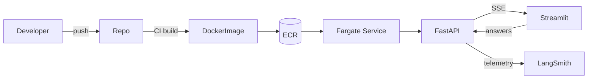
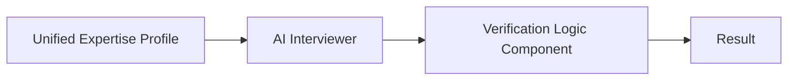

## 12/10/2025

### Prolific Interview Assessment Overview

As part of the prolific interview assessment, I was tasked to design systems that enable high-quality human feedback for AI model evaluation and deployment. The challenge was to design an AI interview system that can engage with participants to vertify their expertise claims.

More specifically, They are asking me to design a system that can process information from participant credentials (CVs,
LinkedIn profiles, Google Scholar), conduct intelligent verification through an AI interviewer approach, and assess expertise in specific domains relevant to AI evaluation tasks.

I will need to prepare a design of the overall architecture for an AI expertise interviewer and verification system and choose ONE component to implement as a POC. I need to prepare to present my approach and implementation within 20 mins.

Core components:
1. Credential Analysis Component - Implement a parser that extracts key skills and expertise claims from a CV, build a system to reconcile information across different sources, or create a skill taxonomy classifier for organizing participant expertise areas.
2. AI Interviewer Component: Design prompt templates that generate domain-specific
verification questions, implement a conversation flow manager that adapts questioning based on responses, or create a mechanism to detect inconsistencies in participant answers.
3. Verification Logic Component: Build a scoring system that evaluates expertise based on response quality, implement a fact-checking mechanism for specific technical claims, or create a confidence estimation system for expertise verification.

Implementation notes:
I am going to use Python as my key programming language. I will use OpenAI API for a base AI model.

What they are looking for:
1. Engineering Fundamentals: Clean code architecture, data flow design, and attention to system boundaries.
2. ML/AI System Design: How you architect a complex system with multiple ML components working together.
3. Technical Depth: Demonstrated knowledge in your implemented component, whether it
involves traditional ML, NLP techniques, or newer approaches
4. Production Thinking: Considerations for scalability, monitoring, and failure modes.
5. Critical Evaluation: How you analyze potential weaknesses and propose mitigations

Most importantly, focus on quality over quantity - a well-designed smaller component is better than a rushed full system.


### Intital thoughts

The AI interviewer pipleine is quite complex, but let's me take a step back and analyse what Prolific is asking for at its core, ground this in a simpler business context:

- Why: Prolific is a platform that connects researchers with high-quality, vetted participants for AI evaluation tasks. Their entir business model rests on the trustworthiness and accuracy of their participants pool.
- The problem: They need to verify that participants who claim to have specific, often technical expertise (e.g., Python expert, Java expert, etc.) actually have that expertise. Manual verification is time-consuming and error-prone. They need a way to efficiently and accurately verify participant expertise.
- The proposal: An "AI interviewer" that can engage with participants to verify their expertise claims, and automates this vetting process.
- The goal: demonstrate that I can design and build a robust, scalable, and thoughtful component for this system, while keeping the bigger picture in mind.

So the main theme here is verification, trust, data quality, and scalability should be at the forefront of my design and my presentation.

### Initial flow of the system

Before desigining the overall system architecture, I need to undersatnd an end-to-end flow of how this system would work.

### Monitoring & Debugging (LangSmith)

- Enable tracing with `LANGCHAIN_TRACING_V2=true`, `LANGCHAIN_PROJECT=<run-label>`, and `LANGSMITH_API_KEY`.
- Capture every LangGraph node invocation; use LangSmith’s compare view to diff prompt revisions and grade outcomes.
- Tag sessions with the `session_id` header so backend + Streamlit logs align with LangSmith traces.
- Export failing runs as shared URLs for design reviews or incident post-mortems.

### Deployment & Operator Surface (Recap Diagram)



Streamlit can either run locally during demos or as its own ECS service behind CloudFront. Both paths reuse the same API surface and tracing setup.

Components:

1. Data Ingestion Service -> Credential Analysis Component:

    ```mermaid
    flowchart LR
    A[Raw Sources CV / LinkedIn / Scholar] --> B[Extracted Entities roles, skills, pubs]
    B --> C[Normalize\n- canonical skill names\n- org name mapping\n- date parsing]
    C --> D[Record-level Merge - roles - skills - publications]
    D --> E[Confidence Scoring - source weights - recency - agreement]
    E --> F[Unified Expertise Profile + provenance per field]
    ```

    - Key challenges: I think the key challenges here are:
        - I need to preprocess the data to extract the key information from the raw files.
        - Define a schema for the data that can be used to extract the key information.
        - Define a way to score the confidence of the extracted information.
        - Define a way to normalise skills in a taxonomy.
        - Union different sources of information to get a more complete picture.


    - An API endpoint that ingests participant credentials (CVs, LinkedIn profiles, link to Google Scholar)
    - Store raw files in a blob storage like S3 or GCP storage
    - Parse the raw files to extract key skills and expertise claims. -> There are different ways to do this. But for now, I will use a simple approach of extracting the text from the files and using a simple LLM with function calling or JSON mode, to extracts structured information (work experience, education, skills, etc.) -> we can extend this to Knowledge Graphs / or replace with a finetunied NER model for better accuracy.
    - PII redaction: for PII redaction, we can use Micorsoft Presidio or our own custom PII redaction model.
    - Skill normaliser: Takes the extracted raw skills and normalises them to a standard format (e.g., "pyTorch","PyTorch Lightning") -> map them to a canonical entity in a central skills Taxonomy Database. This should be done using embeddings and nearest neighbour search.
    - Output: A structured JSON object representing the participant's "claimed expertise profile".

    ```json
    { "skill_canonical": "pytorch","raw_aliases": ["PyTorch Lightning", "pyTorch"],"level_claimed": "advanced",  "experience_years_claimed": 3,"last_used_year": 2025, "evidence": [
    {"source":"cv_upload","span":"...","confidence":0.86}, // This can be weighted by recentness and relevance
    {"source":"linkedin_upload","span":"...","confidence":0.74}
    ],
    "normalization": {
        "taxonomy_id":"ML/Frameworks/PyTorch",
        "method":"embedding+synonym",
        "version":"v1",
        "confidence":0.9
    }
        }
    ```


    - Storage: Store the structured JSON object in a relational database like PostgreSQL.
    - Technical implementation:
        - JD, CV, LI -> trigger an API endpoint -> store raw files -> message queue (e.g., SQS) -> processing pipeline -> structured JSON object -> store in database.
        - API schema:
            - POST /v1/profiles/ingest
                - headers:
                    - Idempotency-Key: <unique request id>
                - content-type: multipart/form-data
                - body:
                    - cv: file (required, max 10MB)
                    - cv_content_type: string (optional, e.g. "application/pdf")
                    - linkedin_url: string (optional)
                    - google_scholar_url: string (optional)
                - response: {profile_id: str}
            - GET /v1/profiles/{id}
                - params: {id: str}
                - response: {
                    profile_id: str,
                    status: str,
                    profile: {
                        "top_skills": [
                            {
                                "skill": str,
                                "level_estimate": str,
                                "confidence": float,
                                "evidence_sources": int,
                                "last_used": int
                            }
                        ],
                        "gaps": [str]
                    },
                    created_at: timestamp
                }
            - GET /v1/profiles/{id}/history
                - params: {id: str}
                - response: {
                    profile_id: str,
                    history: [
                        {
                            timestamp: str,
                            action: str,
                            details: JSON,
                            actor: str
                        }
                    ]
                }
        - Message queue:
            - SQS queue:
                - name: prolific-interview-ingestion-queue
                - message body: {
                    "cv": "base64_encoded_cv",
                    "linkedin": "base64_encoded_linkedin",
                    "google_scholar": "base64_encoded_google_scholar"
                }
        - Database:
            - PostgreSQL:
                - table: prolific_interview_profiles
                - columns: {
                    "profile_id": UUID,
                    "created_at": timestamp,
                    "user_id": UUID,
                    "status": enum("pending", "verified", "rejected"),
                    "reason": text,
                    "profile": JSON
                }
        - Monitoring:
            - Prometheus:
                - metrics: {
                    "ingestion_errors": count,
                    "ingestion_successes": count,
                    "ingestion_time": duration
                }

2. AI Interviewer Component:



- Key challenges: I think the key challenges here are:
    - I need to design a conversation flow manager that adapts questioning based on responses.
    - I need to create a mechanism to detect inconsistencies in participant answers.
    - How do we balance between asking too many questions and asking too few questions?
    - How do we balance on exploration (exploring new skills) and exploitation (confirming existing skills)?
    - How do we handle the case where the participant does not have the skill?

3. Verification Logic Component:


- Key challenges: I think the key challenges here are:
    - I need to design a scoring system that evaluates expertise based on response quality.
    - I need to create a mechanism to detect inconsistencies in participant answers.
    - How do we balance between asking too many questions and asking too few questions?
    - How do we balance on exploration (exploring new skills) and exploitation (confirming existing skills)?

### Selector Policy Deep Dive (UCB & LCB)

1. **Priors & pseudo-counts**
   - `stats_prior_mean` (default 3.0) captures “likely competent” before evidence; higher values demand stronger counter-evidence to deactivate a skill.
   - `stats_prior_strength` and `stats_prior_variance` control how quickly real answers override the prior. Raise the strength for stability; lower it for responsiveness.
2. **UCB sampling**
   - `select_skill_ucb_with_log` computes `mean + C * sqrt(log(t)/n_real)` by default. Set `mode="se"` to swap exploration for `C * standard_error`.
   - Tune `ucb_C` per interview: 1.2 explores more, 0.6 locks onto promising skills sooner.
3. **LCB verification**
   - `compute_uncertainty` stores `se`, `lcb`, and `ucb`. Verification requires `real_n >= min_questions_per_skill` *and* `lcb >= verify_lcb`.
   - Adjust `z_value` to relax or tighten verification. For faster confirmation, drop to 1.28 (≈80 % CI); for conservative runs stick to 1.96 (≈95 %).
4. **Practical tuning tips**
   - If verification stalls below 3.5, either lower `verify_lcb`, shrink `z_value`, or bump the prior mean toward 3.2–3.4.
   - Log `belief_state` snapshots to LangSmith after each `update` to visualise per-skill confidence curves and diagnose stalled verifications.
   - When coverage matters more than depth, increase `ucb_C` and reduce `min_questions_per_skill` so the agent samples broadly before doubling back.
